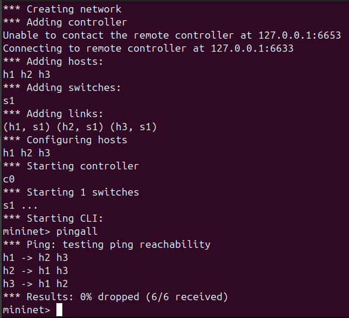
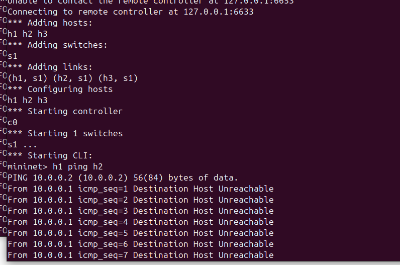
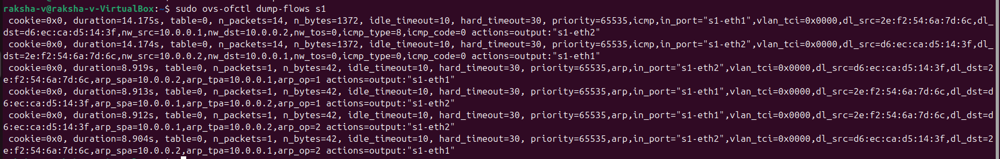
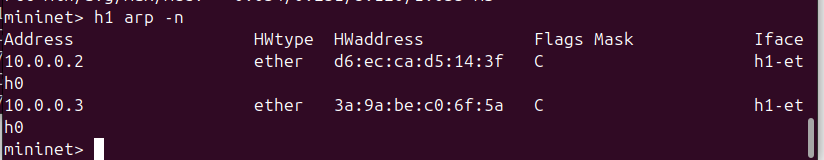
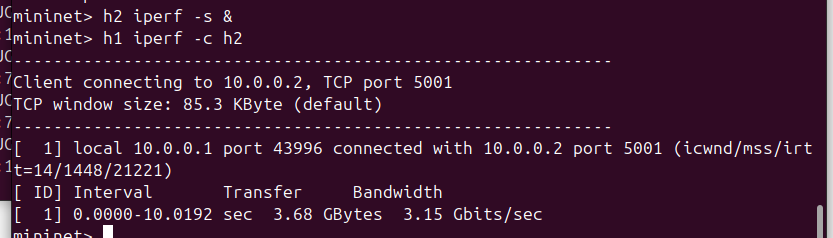

# SDN Project using Mininet and POX Controller

## 📌 Problem Statement
Implement an SDN-based network using Mininet and POX controller to:
- Handle ARP requests
- Enable host discovery
- Implement firewall (blocking traffic)

---

## 🛠️ Setup Instructions

1. Start POX controller:
   ./pox.py log.level --DEBUG openflow.of_01 misc.arp_controller

2. Start Mininet:
   sudo mn --topo single,3 --mac --controller remote

---

## ⚙️ Features Implemented

- ARP handling (host discovery)
- Flow rule installation
- Firewall (blocking h1 → h2)
- Packet_in handling
- Match-Action logic

---

## 🧪 Test Scenarios

### ✅ Scenario 1: Normal Communication
Command:
mininet> pingall

Result:
0% packet loss

---

### ❌ Scenario 2: Firewall Blocking
Command:
mininet> h1 ping h2

Result:
Destination Host Unreachable

---

## 📊 Performance Analysis

- Ping latency measured
- Iperf throughput tested
- Flow table inspected

### Flow Table

### ARP Table

### Iperf Output

---

## 📚 References

- Mininet Documentation
- POX Controller Docs
- OpenFlow Specification
